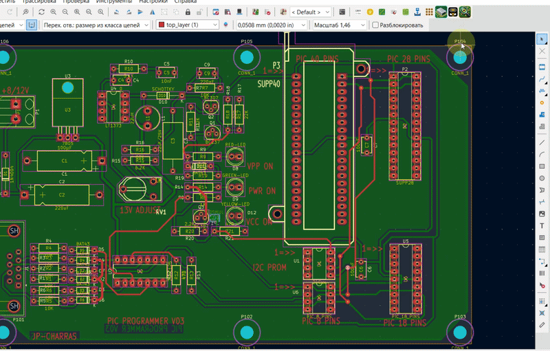

# HoleInspector

**HoleInspector** is a KiCad 10 IPC plugin for inspecting drilled holes
on a PCB by drill size and quickly locating pads and vias on the board.


## Demo

 

## Features

-   Groups drilled objects by hole size
-   Supports round and obround holes
-   Detects drilled pads and vias
-   Shows the number of objects for each drill size
-   Displays pad reference and pad number
-   Quickly locates the selected pad or via on the PCB
-   Centers the KiCad view on the selected object
-   Blinks the selected object for easier identification
-   Double-click an item to locate it
-   **Update** button refreshes the hole list from the current board
-   Remembers the last window position
-   Prevents multiple HoleInspector instances from running at the same
    time
-   Cross-platform settings storage
-   Built using the modern KiCad IPC API (`kicad-python` / `kipy`)

## Requirements

-   KiCad 10.x
-   Python 3.9 or newer
-   `kicad-python >= 0.8.0`
-   `wxPython ~= 4.2`

Dependencies are listed in `requirements.txt`.

## Installation

### Manual installation

Copy the HoleInspector plugin folder into the KiCad user plugins
directory.

**Windows**

``` text
%USERPROFILE%\Documents\KiCad\10.0\plugins\HoleInspector
```

The resulting structure should look like:

``` text
HoleInspector/
├── plugin.json
├── requirements.txt
├── holeinspector_action.py
├── holeinspector_core.py
├── holeinspector_24.png
├── holeinspector_32.png
├── holeinspector_48.png
└── holeinspector_64.png
```

Restart the PCB Editor or refresh the plugins after installation.

## Usage

1.  Open a PCB in KiCad PCB Editor.
2.  Start **HoleInspector** from the plugin toolbar/menu.
3.  Select a hole size from the **Hole** list.
4.  Select a pad or via from **List of Objects**.
5.  Click **Locate**, or double-click the object.
6.  KiCad centers the view on the object and briefly blinks its
    selection.
7.  Click **Update** after modifying the PCB to rebuild the list.

## Settings

HoleInspector remembers the last window position.

Settings are stored outside the plugin directory so they are preserved
when the plugin is updated.

**Windows**

``` text
%LOCALAPPDATA%\HoleInspector\settings.json
```

**Linux**

``` text
$XDG_CONFIG_HOME/HoleInspector/settings.json
```

or, if `XDG_CONFIG_HOME` is not defined:

``` text
~/.config/HoleInspector/settings.json
```

**macOS**

``` text
~/Library/Application Support/HoleInspector/settings.json
```

If the saved window position is no longer visible on any connected
display, HoleInspector opens centered.

## KiCad IPC API

HoleInspector uses the modern KiCad IPC API rather than the legacy SWIG
`pcbnew` Python API.

Main Python package:

``` text
kicad-python
```

The plugin communicates with the currently running KiCad PCB Editor
through `kipy`.

## Version

Current version: **1.0**


## License

This project is licensed under the **GNU General Public License v3.0
(GPL-3.0)**.

See the `LICENSE` file for the full license text.
