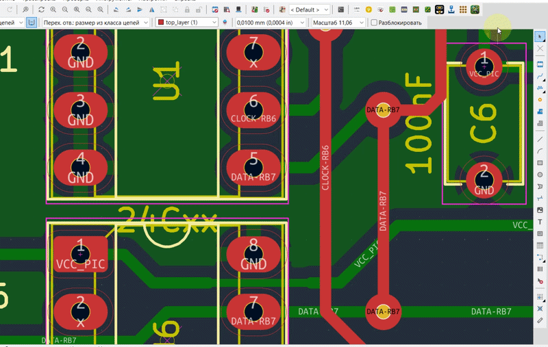

# HoleFinder

**HoleFinder** is a KiCad 10 IPC plugin for inspecting drilled pads and vias
by drill size or net and quickly locating them on the PCB.


## Demo



## Features

- Groups drilled objects by **hole size** or **net**
- Quickly switches between **Hole** and **Net** modes
- Supports round and obround holes
- Detects drilled pads and vias
- Shows the number of objects in each group
- Displays pad reference and pad number
- Shows the net name for each object in **Hole** mode
- Shows the drill size for each object in **Net** mode
- Supports objects without an assigned net (`No net`)
- Quickly locates the selected pad or via on the PCB
- Centers the KiCad view on the selected object
- Blinks the selected object for easier identification
- Double-click an item to locate it
- **Update** button refreshes the data from the current board
- Remembers the last window position
- Prevents multiple HoleFinder instances from running at the same time
- Handles KiCad IPC connection/token mismatch errors with a user-friendly message
- Cross-platform settings storage
- Built using the modern KiCad IPC API (`kicad-python` / `kipy`)

## Requirements

- KiCad 10.x
- Python 3.9 or newer
- `kicad-python >= 0.8.0`
- `wxPython ~= 4.2`

Dependencies are listed in `requirements.txt`.

## Installation

### Manual installation

Copy the HoleFinder plugin folder into the KiCad user plugins directory.

**Windows**

```text
%USERPROFILE%\Documents\KiCad\10.0\plugins\HoleFinder
```

The resulting structure should look like:

```text
HoleFinder/
├── plugin.json
├── requirements.txt
├── holefinder_action.py
├── holefinder_core.py
├── holefinder_24.png
├── holefinder_32.png
├── holefinder_48.png
└── holefinder_64.png
```

Restart the PCB Editor or refresh the plugins after installation.

## Usage

1. Open a PCB in KiCad PCB Editor.
2. Start **HoleFinder** from the plugin toolbar/menu.
3. Use the **Hole / Net** button to select the grouping mode.
4. In **Hole** mode, select a drill size to see the corresponding pads and vias.
5. In **Net** mode, select a net to see all drilled pads and vias belonging to that net.
6. Select a pad or via from **List of Objects**.
7. Click **Locate**, or double-click the object.
8. KiCad centers the view on the object and briefly blinks its selection.
9. Click **Update** after modifying the PCB to rebuild the list.

## Settings

HoleFinder remembers the last window position.

Settings are stored outside the plugin directory so they are preserved
when the plugin is updated.

**Windows**

```text
%LOCALAPPDATA%\HoleFinder\settings.json
```

**Linux**

```text
$XDG_CONFIG_HOME/HoleFinder/settings.json
```

or, if `XDG_CONFIG_HOME` is not defined:

```text
~/.config/HoleFinder/settings.json
```

**macOS**

```text
~/Library/Application Support/HoleFinder/settings.json
```

If the saved window position is no longer visible on any connected
display, HoleFinder opens centered.

## KiCad IPC API

HoleFinder uses the modern KiCad IPC API rather than the legacy SWIG
`pcbnew` Python API.

Main Python package:

```text
kicad-python
```

The plugin communicates with the currently running KiCad PCB Editor
through `kipy`.

If multiple PCB Editor instances are running, KiCad may reject the IPC
connection because the IPC token does not match the current KiCad instance.
HoleFinder detects this condition and displays a warning instead of an
unhandled exception.

## Version

Current version: **1.1**

### What's new in 1.1

- Added **Hole / Net** mode switching
- Added grouping of pads and vias by net
- Added net names to the object list in **Hole** mode
- Added drill sizes to the object list in **Net** mode
- Added support for displaying objects with `No net`
- Improved handling of KiCad IPC connection/token mismatch errors

## License

This project is licensed under the **GNU General Public License v3.0
(GPL-3.0)**.

See the `LICENSE` file for the full license text.
